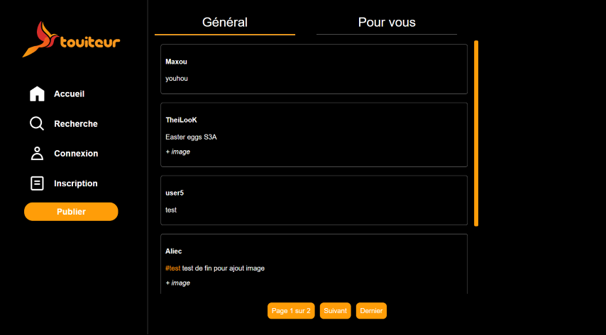
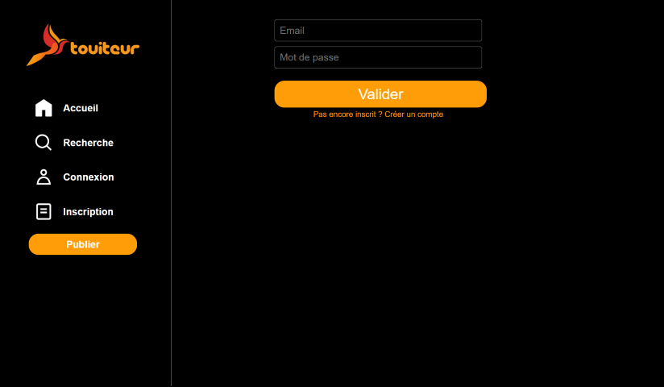
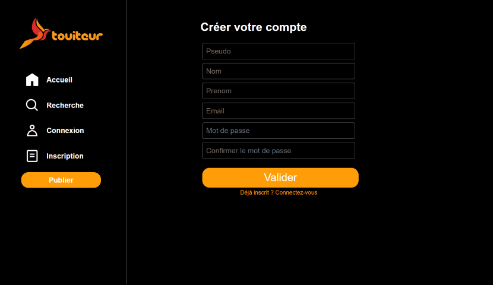

S3A-SAE-Dev-Web
===
### Made by :
- [BRUSON Paul](https://github.com/Dr-J-Watson)
- [CHAIX Maxence](https://github.com/MaxenceChx)
- [MELLANO Louka](https://github.com/TheiLooK)
- [QUILLIEC Amaury](https://github.com/Aliec-AQ)
- [REVEILLARD Fabio](https://github.com/Z0ROZ)

---
### How to use the WebSite :

- [1. For the new users](#1-for-the-new-users-)
- - [1.1. You have access to](#11-you-have-access-to-)
- - [1.2. You can do](#12-you-can-)
- [2. For the users who already have an account](#2-for-the-users-who-already-have-an-account-)
- [3. For the administrators](#3-for-the-administrators-)

---
# 1. For the new users :
## 1.1. You have access to :
- The home page :

- The login page :

- The register page :

- The search page :

  - The users profile page :

## 1.2. You can :
- Read all the touites
- Look at the profile of a user when you click on his name
- Search all ocurances of a tag when you click on it
- Search a @user, a #tag or a word in the search bar
- Register
- Login

## 1.3. You CAN'T :
> All what you can't do redirect you to the login page
- Post a touite
- Like or dislike a touite
- Follow or unfollow a user
- Access to the for you page
- Access to the ADMIN page

## 1.4. How to register if you don't have an account :
- Click on the register button on the home page
- Fill the form with your informations
- Click on the register button

## 1.5. How to login if you already have an account :
- Click on the login button on the home page
- Fill the form with your informations
- Click on the login button

---
## 2. For the users who already have an account :
TODO

---
## 3. For the administrators :
TODO

---
### Sources
- Icons : [x.com](https://twitter.com/)
- Logo : [DALL-E by OpenAI](https://openai.com/blog/dall-e/)

---